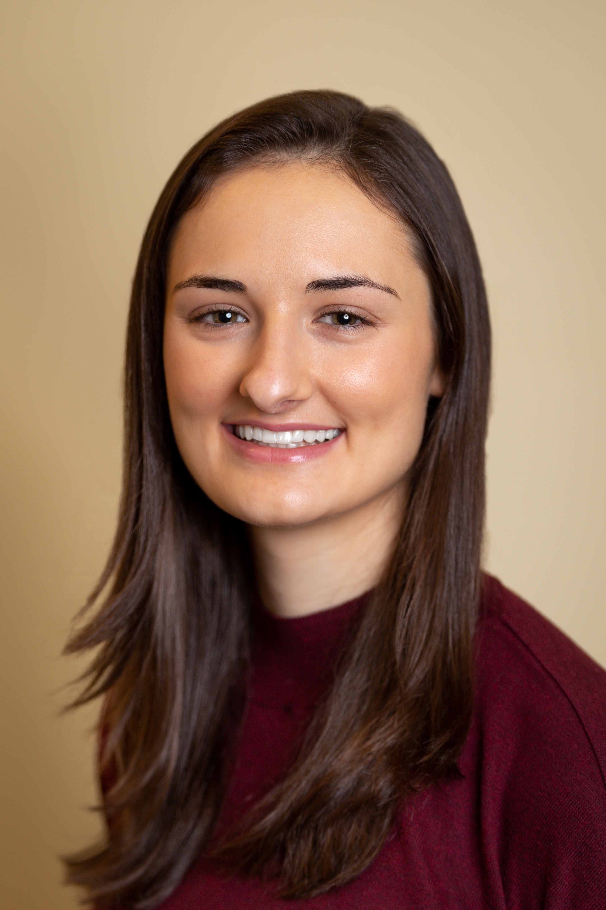
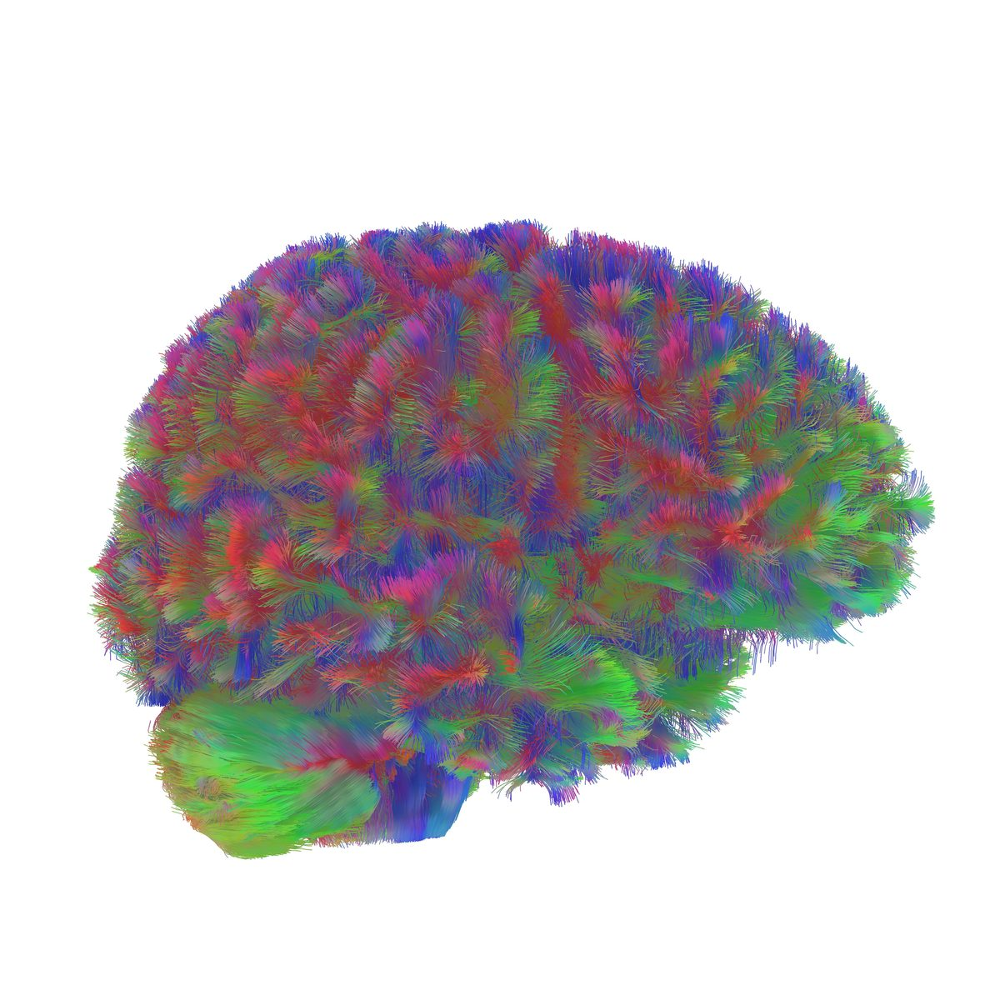
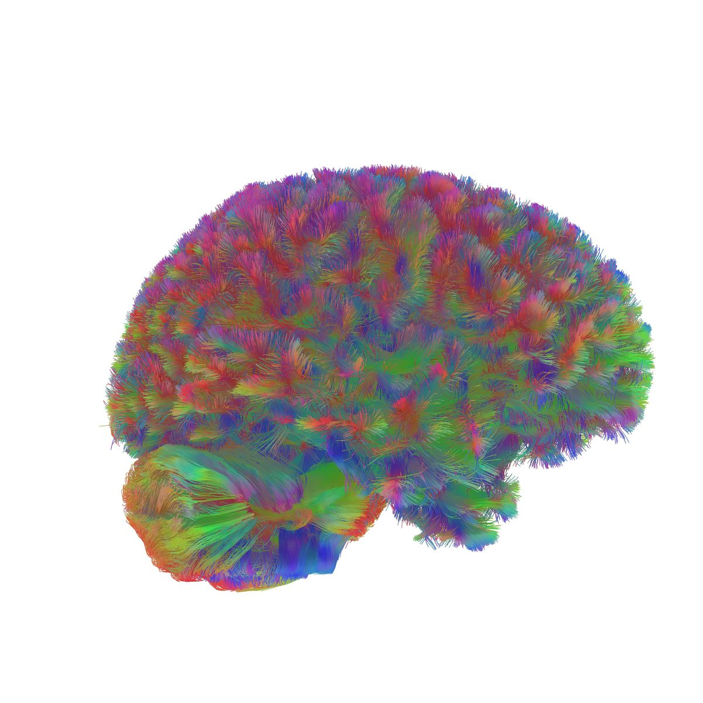
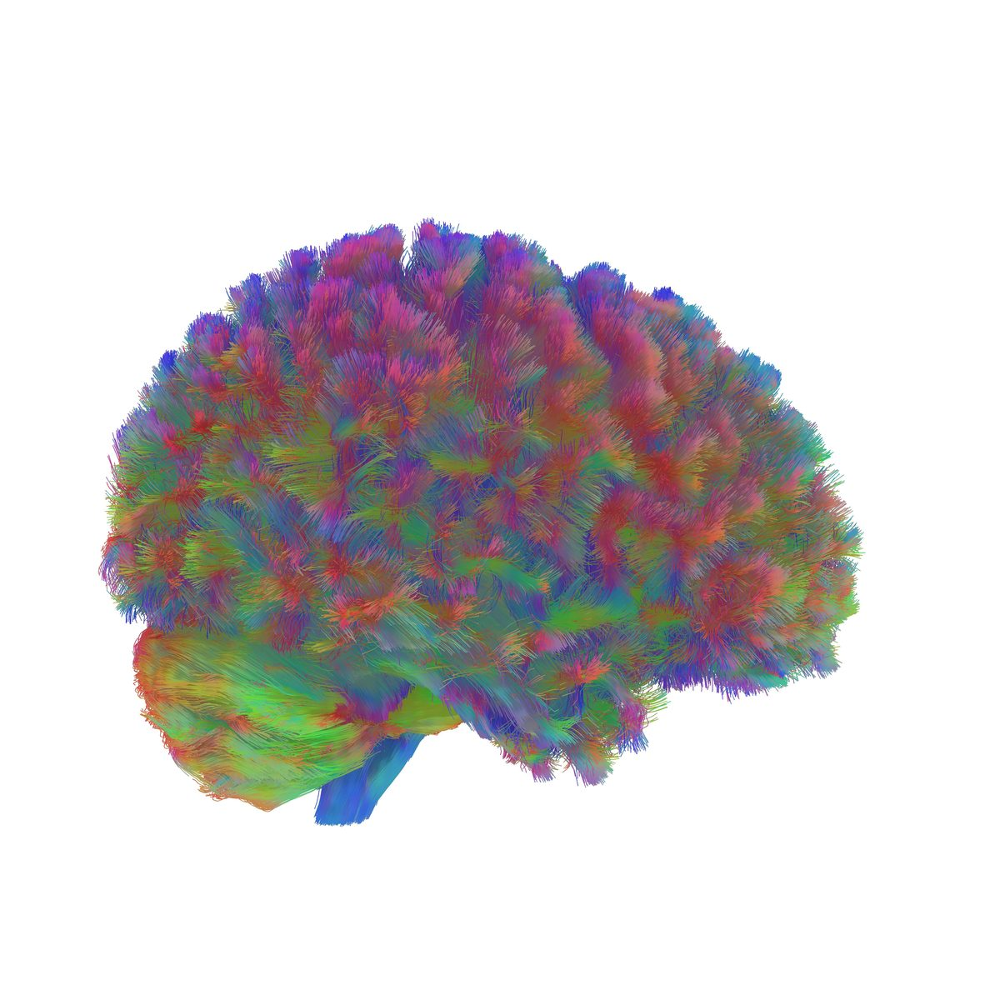
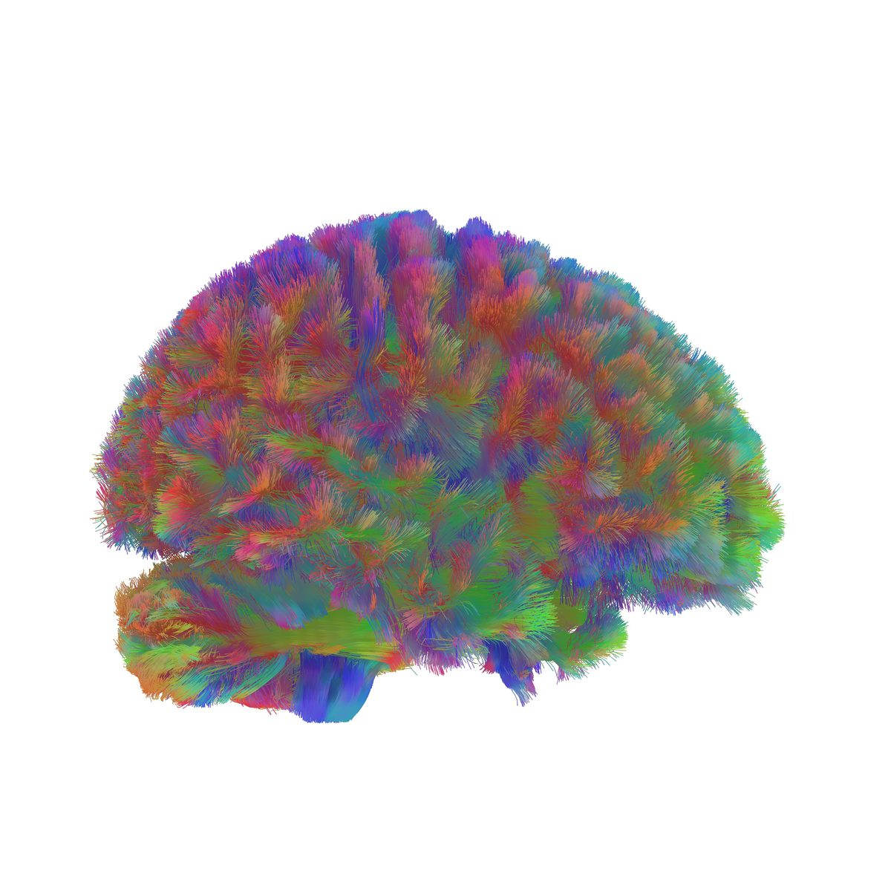
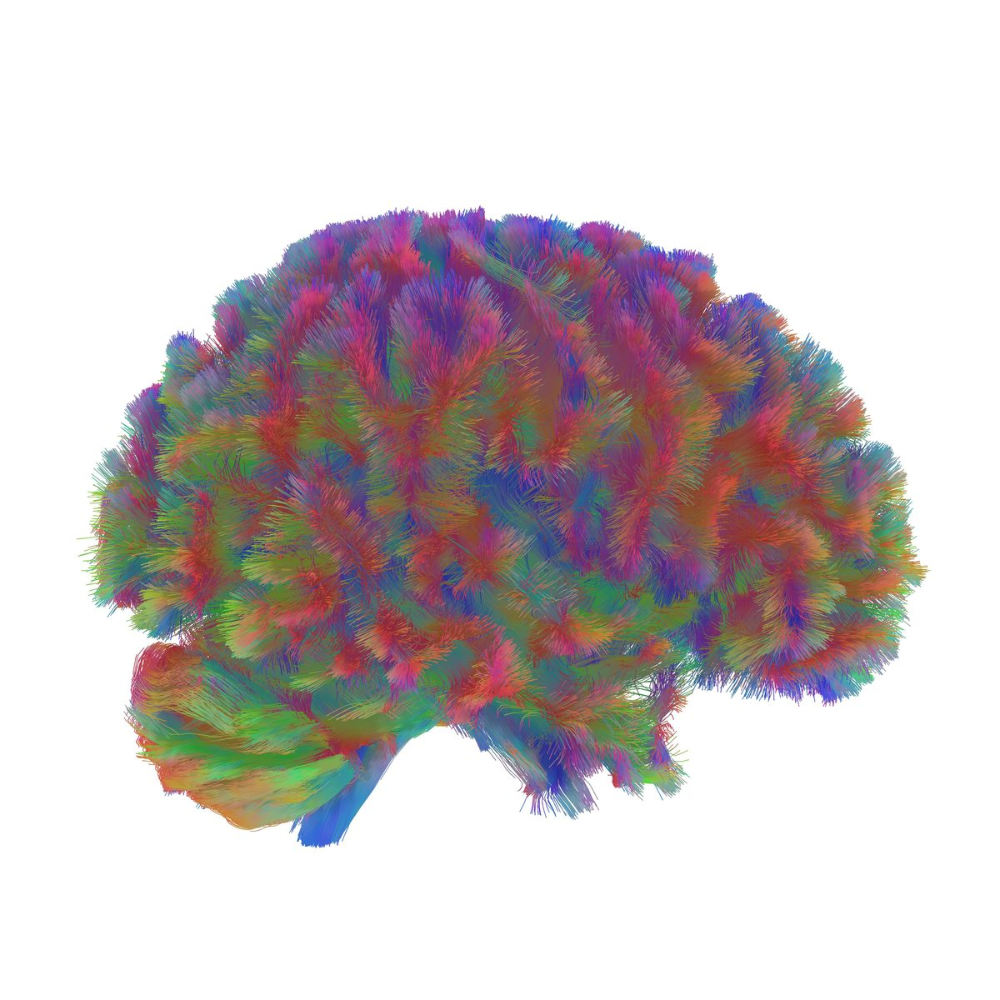

::: {.hero}

::: {.hero-photo}
{fig-alt="Alexa Mousley"}
:::

::: {.hero-text}
# Alexa Mousley

::: {.role}
Postdoctoral Research Associate
:::

::: {.affiliation}
[4D Lab](https://www.astlelab.com/), [Department of Psychiatry](https://www.psychiatry.cam.ac.uk/) · [University of Cambridge](https://www.cam.ac.uk/)
:::

I'm a developmental neuroscientist studying how the brain's structural connections form, refine, and reorganise across the human lifespan.

::: {.social-row}
[ Email](mailto:alexa.mousley@mrc-cbu.cam.ac.uk)
[ Scholar](https://scholar.google.com/citations?user=nR6ga7UAAAAJ&hl=en)
[ GitHub](https://github.com/alexamousley)
[ Bluesky](https://bsky.app/profile/alexamousley.bsky.social)
[ LinkedIn](https://www.linkedin.com/in/alexa-mousley/)
[ CV](assets/Mousley_CV.pdf)
:::

:::

:::

::: {.epoch-strip}
::: {.epoch}
{fig-alt="Childhood brain network — diffusion tractography reconstruction"}
[Childhood]{.epoch-label}
:::
::: {.epoch}
{fig-alt="Adolescent brain network — diffusion tractography reconstruction"}
[Adolescence]{.epoch-label}
:::
::: {.epoch}
{fig-alt="Adult brain network — diffusion tractography reconstruction"}
[Adulthood]{.epoch-label}
:::
::: {.epoch}
{fig-alt="Early-ageing brain network — diffusion tractography reconstruction"}
[Early ageing]{.epoch-label}
:::
::: {.epoch}
{fig-alt="Late-ageing brain network — diffusion tractography reconstruction"}
[Late ageing]{.epoch-label}
:::
:::

::: {.epoch-caption}
Read about the five eras of human brain network organisation ([*Nature Communications*, 2025](https://doi.org/10.1038/s41467-025-65974-8)).
:::

## About

I'm a developmental neuroscientist working at the intersection of brain imaging, network science, and machine learning. My research explores the wiring of the developing brain as it developes and changes across the lifespan in the context of genetic and environmental influences.

I'm currently a postdoc in the [4D Lab](https://www.astlelab.com/) at Cambridge, where I investigate how brain connectivity relates to adolescent mental health, cognition, genetics, and adverse experiences in young people from the [Adolescent Brain Cognitive Development study](https://abcdstudy.org/). In my PhD, supported by the [Gates Cambridge Scholarship](https://www.gatescambridge.org/), my research identified the major topological turning points in the human connectome — published in *Nature Communications* (2025) and covered by [BBC News](https://www.bbc.co.uk/news/articles/cgl6klez226o), [The Guardian](https://www.theguardian.com/science/2025/nov/25/brain-human-cognitive-development-life-stages-cambridge-study), [The Wall Street Journal](https://www.wsj.com/health/wellness/brain-stages-aging-five-study-nature-a015101e), and over 340 other outlets worldwide.

## Research themes {.section-heading}

::: {.theme-card}
### Brain network development across the lifespan

How does the human connectome reorganise as we age? Using diffusion MRI and graph theory across thousands of brains — from neonates to nonagenarians — my work identifies the developmental turning points where the brain's wiring rules fundamentally shift. [Read more →](research.html)
:::

::: {.theme-card}
### Generative models of connectome formation

Why do brains wire the way they do? I build computational models that simulate how connections form under competing constraints — physical cost versus communication efficiency. Applied to preterm infants, these models reveal how life circumstances relate to different contraints in brain development.
:::

::: {.theme-card}
### Brain architecture and critical periods of development

In my current postdoc, I'm investigating how patterns of structural connectivity (i.e., connectivity signatures) relate to individual vulnerability and resilience during the formative period of adolescence.
:::

## In the news {.section-heading}

My research has been featured in **BBC News**, **Sky News**, **The Guardian**, **The Wall Street Journal**, **The Times**, **Scientific American**, and **National Geographic**, and over 340 other outlets worldwide. [See full coverage →](media.html)

## Beyond academics {.section-heading}

Outside the lab, I'm usually woodworking, and I sometimes share what I make on Instagram at [\@handcraftedby_alexa](https://www.instagram.com/handcraftedby_alexa/). When I'm not making sawdust, I'm hiking or playing basketball.
