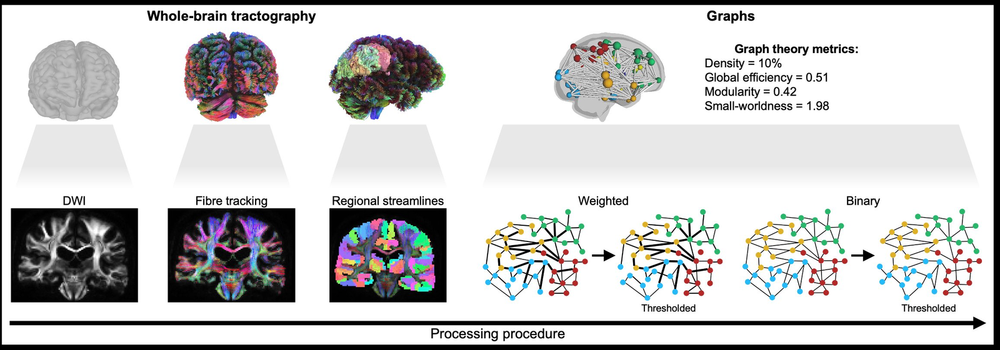
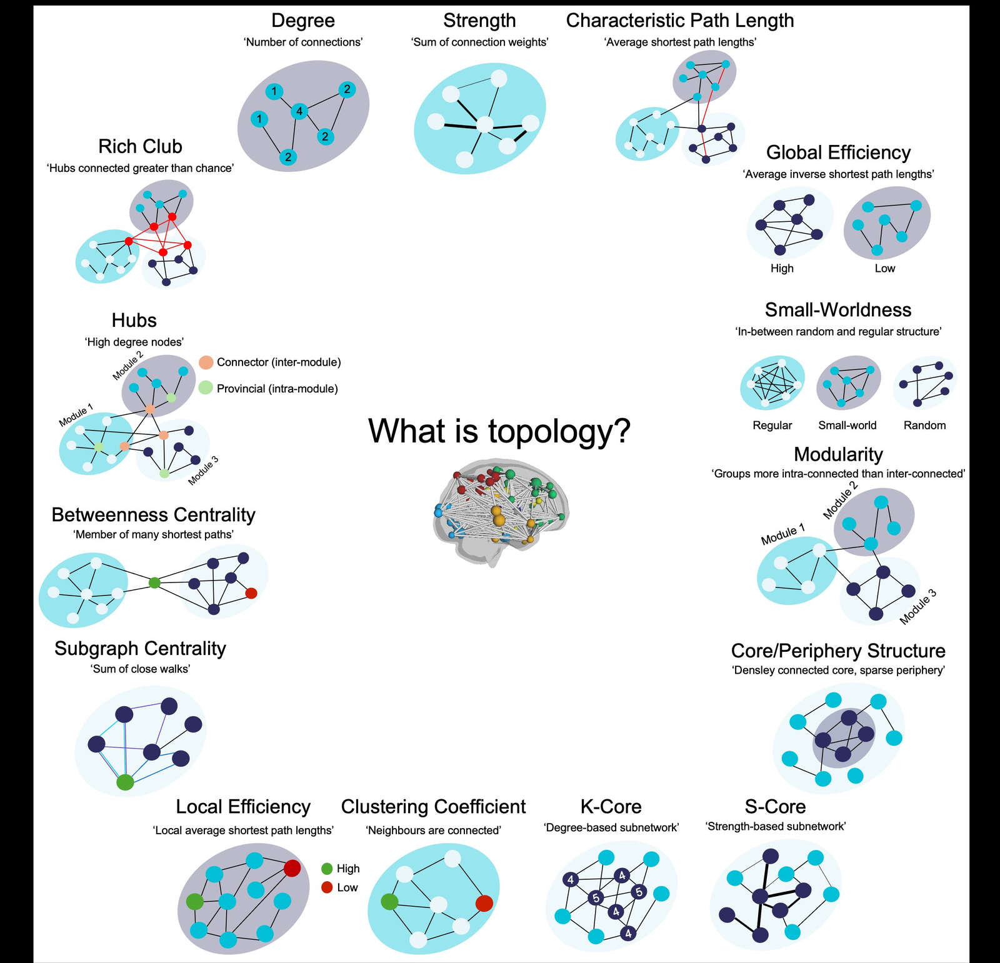

## Overview

How do billions of neurons organise into the structured, efficient, hierarchical networks that support cognition and behaviour, and how these networks change across the lifespan and in the face of life experiences?

To explore these overarching questions, I utilize open MRI datasets to map in vivo structural brain networks. I explore these networks with a variety of methods, such as generative network modelling and machine learning. 

::: {.figure-block}
{fig-alt="Infographic illustrating fourteen graph-theoretic measures used to characterise brain network topology: degree, strength, characteristic path length, global and local efficiency, modularity, small-worldness, rich-club organisation, hubs, betweenness centrality, subgraph centrality, clustering coefficient, k-core, s-core, and core-periphery structure."}

::: {.figure-caption}
Diffusion-weighted MRIs are converted into whole-brain tractography, parcellated into regional streamlines, and represented as a graphs for analysis.
:::
:::

## What is brain topology?

Once the brain is represented as a graph — nodes connected by edges — we can quantify its organisation in many different ways. Each metric captures a different aspect of how the network is structured.

::: {.figure-block}
{fig-alt="Schematic of the tractography pipeline: diffusion-weighted imaging, fibre tracking, regional streamlines, and graph construction with metrics."}

::: {.figure-caption}
A primer on the graph-theoretic measures used to characterise brain network topology — from local properties like clustering coefficient to global metrics like efficiency and modularity.
:::
:::

## Selected publications

::: {.pub-entry}
::: {.authors}
**Mousley, A.**, Bethlehem, R., Yeh, F-C., & Astle, D.E. (2025).
:::
Topological turning points across the human lifespan. [*Nature Communications*]{.journal}, 16(1), 10005.

::: {.pub-links}
[DOI](https://doi.org/10.1038/s41467-025-65974-8) · [Full text](https://www.nature.com/articles/s41467-025-65974-8)
:::
:::

::: {.pub-entry}
::: {.authors}
**Mousley, A.**, Akarca, D., & Astle, D.E. (2025).
:::
Premature birth changes wiring constraints in neonatal structural brain networks. [*Nature Communications*]{.journal}, 16(1), 490.

::: {.pub-links}
[DOI](https://doi.org/10.1038/s41467-024-55178-x) · [Full text](https://www.nature.com/articles/s41467-024-55178-x)
:::
:::

::: {.pub-entry}
::: {.authors}
Mitchell, D.J., **Mousley, A.L.S.**, Shafto, M.A., & Duncan, J. (2023).
:::
Neural contributions to reduced fluid intelligence across the adult lifespan. [*Journal of Neuroscience*]{.journal}, 43(2), 293–307.

::: {.pub-links}
[DOI](https://doi.org/10.1523/JNEUROSCI.0148-22.2022)
:::
:::

[See full publication list →](publications.html)
